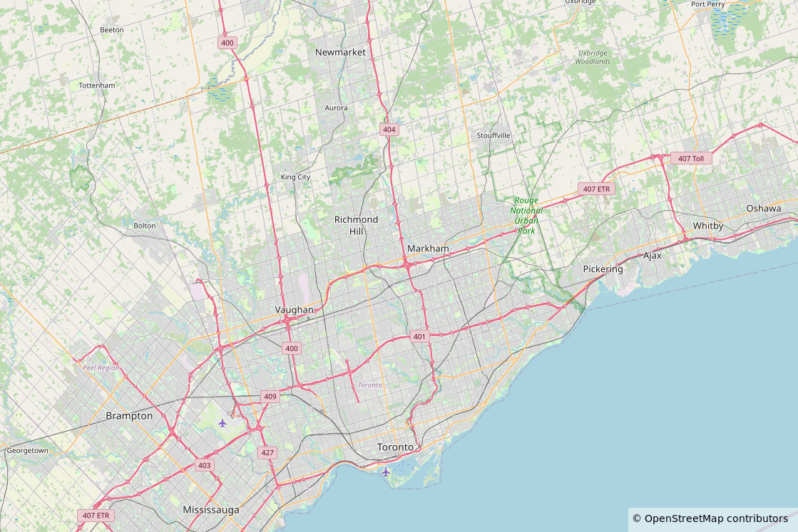

# 2025 Display Next Hackfest

## About

The Display Next Hackfest is an event where talented developers will
gather to explore the latest technologies and trends in the Linux
Display Stack. It has an unconference format where participants propose
topics for presenting, roadmapping, discussing and examining together.
It aims to unblock bottlenecks, design solutions, raise pitfalls and
accommodate the needs of each layer of the display stack. Participants
should feel free to propose any topic which interests them. Some topics
from the previous edition include: HDR and color management, frame
timing and variable refresh rate (VRR), atomic flips, backlight control,
testing and CI, etc.

## Where and When

**Date:** July 8-10 (Tue-Thu), 2025

**Location:** AMD is hosting the 2025 Display Next Hackfest in Markham at the AMD office:

AMD Markham  
1 Commerce Valley Drive E.  
Markham ON  
Canada  

## Plans and Goals

1. **Keep moving!** Continue your work on upstream design, implementation and documentation until the hackfest.
1. **“Are you okay with that?”** Present the current status of your work, explain decisions, concerns and results. Let’s compromise.
1. **Share your pains.** What is well aligned with the generic approach? What is not (singularities) and how can we find room for it? Whatever your doubts, we resolve them together!
1. **“Something went wrong.”** Share failing tests or inconsistent results. Let’s take a look together and find how to overcome them!

The hackfest will last three days following an “Unconference” format. Check the event timetable and agenda below.

Information about the previous years can be found at
- [2024 Display Next Hackfest](https://events.pages.igalia.com/linuxdisplaynexthackfest/)
- [Shell & Display Next 2023 wiki](https://wiki.gnome.org/Hackfests/ShellDisplayNext2023)

## Timetable

TBD

## Agenda

The Agenda is driven by all interested parties. Please add agenda items
on the [Topics & Talks
wiki](https://github.com/hwentland/2025linuxdisplayhackfest/wiki/Topics-&-Talks)
and indicate whether you'll be able to lead or co-lead an item.

## Participants

Please add yourself to the [List of
Participants](https://github.com/hwentland/2025linuxdisplayhackfest/wiki/List-of-Participants)
and indicate your planned arrival departure data or whether you'll be
attending remotely.

## Travel and Accomodation

There are a number of hotels in the vicinity of the AMD office.

Details TBD

## Code of Conduct

TBD