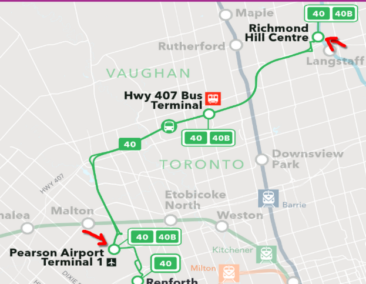
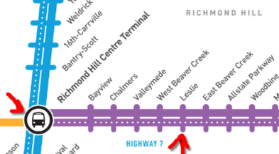

# 2025 Display Next Hackfest

## About

The Display Next Hackfest is an event where talented developers will
gather to explore the latest technologies and trends in the Linux
Display Stack. It has an unconference format where participants propose
topics for presenting, roadmapping, discussing and examining together.
It aims to unblock bottlenecks, design solutions, raise pitfalls and
accommodate the needs of each layer of the display stack. Participants
should feel free to propose any topic which interests them. Some topics
from the previous edition include: HDR and color management, frame
timing and variable refresh rate (VRR), atomic flips, backlight control,
testing and CI, etc.

## Where and When

**Date:** July 8-10 (Tue-Thu), 2025

**Location:** AMD is hosting the 2025 Display Next Hackfest in Markham at the AMD office:

AMD Markham  
1 Commerce Valley Drive E.  
Markham ON  
Canada  

<iframe src="https://www.google.com/maps/embed?pb=!1m18!1m12!1m3!1d2877.2674212970196!2d-79.38204528755145!3d43.83881284028466!2m3!1f0!2f0!3f0!3m2!1i1024!2i768!4f13.1!3m3!1m2!1s0x89d4d4b2af96d6ab%3A0x30843602254cea95!2sAMD!5e0!3m2!1sen!2sca!4v1743520899754!5m2!1sen!2sca" width="800" height="600" style="border:0;" allowfullscreen="" loading="lazy" referrerpolicy="no-referrer-when-downgrade"></iframe>

## Plans and Goals

1. **Keep moving!** Continue your work on upstream design, implementation and documentation until the hackfest.
1. **“Are you okay with that?”** Present the current status of your work, explain decisions, concerns and results. Let’s compromise.
1. **Share your pains.** What is well aligned with the generic approach? What is not (singularities) and how can we find room for it? Whatever your doubts, we resolve them together!
1. **“Something went wrong.”** Share failing tests or inconsistent results. Let’s take a look together and find how to overcome them!

The hackfest will last three days following an “Unconference” format. Check the event timetable and agenda below.

Information about the previous years can be found at
- [2024 Display Next Hackfest](https://events.pages.igalia.com/linuxdisplaynexthackfest/)
- [Shell & Display Next 2023 wiki](https://wiki.gnome.org/Hackfests/ShellDisplayNext2023)

## Timetable

### Day 1 - Tuesday, July 8

| Time          | Topic                                        | Topic Lead   |
| ------------- | -------------------------------------------- | -------------|
| 08:30 - 09:00 | Reception & Breakfast                        |              |
| 09:00 - 09:30 | Welcome (AMD Exec & Intro)                   | Syed Hussain, Chris Smith |
| 09:30 - 10:00 | Agenda & Topics Intro                        |              |
| 10:00 - 11:00 | ACS - MPO, HDR, and Freesync                 | Shashank Sharma |
| 11:00 - 11:20 | Break                                        |              |
| 11:20 - 12:50 | Commit Failure Feedback                      |  |
| 12:50 - 13:50 | Lunch                                        |              |
| 13:50 - 14:50 | Async pageflip failures                      | Melissa Wen |
| 15:30 - 15:50 | Break                                        |              |
| 15:50 - 16:50 | Backlight Improvements                       | Mario Limonciello |
| 16:50 - 17:50 | DP Aux Improvements                          | Sean Paul |

### Day 2 - Wednesday, July 9

| Time          | Topic                                        | Topic Lead   |
| ------------- | -------------------------------------------- | -------------|
| 09:00 - 09:30 | Recap & Planning                             |              |
| 09:30 - 10:30 | Color & HDR Status                           |  |
| 10:30 - 10:50 | Break                                        |              |
| 10:50 - 12:50 | Color & HDR Q&A                              | **Moderation**: Harry Wentland **Experts**: Dr. Charles Poynton, Keith Lee |
| 12:50 - 13:50 | Lunch                                        |              |
| 13:50 - 14:50 | Color & HDR – DRM/KMS                        | Alex Hung |
| 14:50 - 15:10 | Break                                        |              |
| 15:10 - 16:40 | Color & HDR – Compositors & applications     |  |
| 16:40 - 17:00 | Break                                        |              |
| 17:00 - 18:00 | CI, DRM CI, IGT                              | Melissa Wen, Louis Chauvet |

### Day 3 - Thursday, July 10

| Time          | Topic                                        | Topic Lead   |
| ------------- | -------------------------------------------- | -------------|
| 09:00 - 09:30 | Recap & Planning                             |              |
| 09:30 - 11:00 | Real-time Scheduling                         | Xaver Hugl |
| 11:00 - 11:20 | Break                                        |              |
| 11:20 - 12:05 | Per-CRTC page-flip event requests            | Simon Ser |
| 12:05 - 12:50 | VRR for Desktop Use-Cases                    | Leo Li |
| 12:50 - 13:50 | Lunch                                        |              |
| 13:50 - 14:50 | Desktop Testing Framework                    | Leo Li |
| 14:50 - 15:50 | Open Session ___Slow Atomic Check                                 |              |
| 15:30 - 16:30 | Wrap-Up                                      |              |

## Agenda

The Agenda is driven by all interested parties. Please add agenda items
on the [Topics & Talks
wiki](https://github.com/hwentland/2025linuxdisplayhackfest/wiki/Topics-&-Talks)
and indicate whether you'll be able to lead or co-lead an item.

## Participants

Please add yourself to the [List of
Participants](https://github.com/hwentland/2025linuxdisplayhackfest/wiki/List-of-Participants)
and indicate your planned arrival departure data or whether you'll be
attending remotely.

## Hotels

Both of these hotels are right next door to the AMD office:

- Courtyard by Marriott Toronto/Markham
- Residence Inn Toronto Markham

These are also within a short walk from the office:

- Hilton Garden Inn Toronto/Markham
- Holiday Inn Express & Suites Toronto-Markham

You should be able to ask for AMD corporate rates at these hotels. I'm
happy to send you the corporate rates if you need but don't want to
advertise them in public. If you have problems booking the hotel our
office admin can help with that with check-in/out dates, names, and
credit card info.

## How to Get Here

### By Air

Fly into Pearson International Airport (YYZ).

Then take the [Go Bus #40](https://assets.metrolinx.com/image/upload/v1734509172/Documents/GO/full-schedules/FS04012025/TABLE40.pdf) from Pearson Terminal 1 to Richmond Hill Centre. It comes roughly [every half an hour](https://www.gotransit.com/en/see-schedules?tripPoint=75723&departure=PA&destination=00350&date=2025-03-31&transfers=true) during the day.

From Richmond Hill Centre take the purple line bus to Leslie.

### By Train

Take a train (VIA Rail, or Amtrak) to Union Station in Toronto. Then take the [subway](https://cdn.ttc.ca/-/media/Project/TTC/DevProto/Images/Home/Routes-and-Schedules/Landing-page-pdfs/TTC_SubwayStreetcarMap_2021-11.pdf?rev=909317034177450b8b09ba5b247e24bf) up to Finch station, the [Viva Blue](https://www.yrt.ca/en/schedules-and-maps/resources/Documents/system-maps/Viva-System-Map_Web_Nov2024.pdf) bus to Richmond Hill Centre, and the Viva Purple bus to Leslie.

### By Car

Punch the address below into your SatNav and go. Select "Avoid Tolls" and avoid getting onto Hwy 407 to avoid exorbitant tolls. All the other roads in the area are toll free, though quite busy.

1 Commerce Valley Drive E.  
Markham ON  
Canada  

## Code of Conduct

The code of conduct for the conference will be the [Contributor Covenant Code of Conduct v2.1](https://www.contributor-covenant.org/version/2/1/code_of_conduct/).

## Contributor Covenant Code of Conduct

### Our Pledge

We as members, contributors, and leaders pledge to make participation in our
community a harassment-free experience for everyone, regardless of age, body
size, visible or invisible disability, ethnicity, sex characteristics, gender
identity and expression, level of experience, education, socio-economic status,
nationality, personal appearance, race, caste, color, religion, or sexual
identity and orientation.

We pledge to act and interact in ways that contribute to an open, welcoming,
diverse, inclusive, and healthy community.

### Our Standards

Examples of behavior that contributes to a positive environment for our
community include:

* Demonstrating empathy and kindness toward other people
* Being respectful of differing opinions, viewpoints, and experiences
* Giving and gracefully accepting constructive feedback
* Accepting responsibility and apologizing to those affected by our mistakes,
  and learning from the experience
* Focusing on what is best not just for us as individuals, but for the overall
  community

Examples of unacceptable behavior include:

* The use of sexualized language or imagery, and sexual attention or advances of
  any kind
* Trolling, insulting or derogatory comments, and personal or political attacks
* Public or private harassment
* Publishing others' private information, such as a physical or email address,
  without their explicit permission
* Other conduct which could reasonably be considered inappropriate in a
  professional setting

### Enforcement Responsibilities

Community leaders are responsible for clarifying and enforcing our standards of
acceptable behavior and will take appropriate and fair corrective action in
response to any behavior that they deem inappropriate, threatening, offensive,
or harmful.

Community leaders have the right and responsibility to remove, edit, or reject
comments, commits, code, wiki edits, issues, and other contributions that are
not aligned to this Code of Conduct, and will communicate reasons for moderation
decisions when appropriate.

### Scope

This Code of Conduct applies within all community spaces, and also applies when
an individual is officially representing the community in public spaces.
Examples of representing our community include using an official email address,
posting via an official social media account, or acting as an appointed
representative at an online or offline event.

### Enforcement

Instances of abusive, harassing, or otherwise unacceptable behavior may be
reported to the community leaders responsible for enforcement:
* Victoria Brekenfeld <<victoria@system76.com>>
* Charlie Wang <<Yu.Wang4@amd.com>>
* Melissa Wen <<mwen@igalia.com>>
* Harry Wentland <<harry.wentland@amd.com>>

All complaints will be reviewed and investigated promptly and fairly.

All community leaders are obligated to respect the privacy and security of the
reporter of any incident.

### Enforcement Guidelines

Community leaders will follow these Community Impact Guidelines in determining
the consequences for any action they deem in violation of this Code of Conduct:

#### 1. Correction

**Community Impact**: Use of inappropriate language or other behavior deemed
unprofessional or unwelcome in the community.

**Consequence**: A private, written warning from community leaders, providing
clarity around the nature of the violation and an explanation of why the
behavior was inappropriate. A public apology may be requested.

#### 2. Warning

**Community Impact**: A violation through a single incident or series of
actions.

**Consequence**: A warning with consequences for continued behavior. No
interaction with the people involved, including unsolicited interaction with
those enforcing the Code of Conduct, for a specified period of time. This
includes avoiding interactions in community spaces as well as external channels
like social media. Violating these terms may lead to a temporary or permanent
ban.

#### 3. Temporary Ban

**Community Impact**: A serious violation of community standards, including
sustained inappropriate behavior.

**Consequence**: A temporary ban from any sort of interaction or public
communication with the community for a specified period of time. No public or
private interaction with the people involved, including unsolicited interaction
with those enforcing the Code of Conduct, is allowed during this period.
Violating these terms may lead to a permanent ban.

#### 4. Permanent Ban

**Community Impact**: Demonstrating a pattern of violation of community
standards, including sustained inappropriate behavior, harassment of an
individual, or aggression toward or disparagement of classes of individuals.

**Consequence**: A permanent ban from any sort of public interaction within the
community.

### Attribution

This Code of Conduct is adapted from the [Contributor Covenant][homepage],
version 2.1, available at
[https://www.contributor-covenant.org/version/2/1/code_of_conduct.html][v2.1].

Community Impact Guidelines were inspired by
[Mozilla's code of conduct enforcement ladder][Mozilla CoC].

For answers to common questions about this code of conduct, see the FAQ at
[https://www.contributor-covenant.org/faq][FAQ]. Translations are available at
[https://www.contributor-covenant.org/translations][translations].

[homepage]: https://www.contributor-covenant.org
[v2.1]: https://www.contributor-covenant.org/version/2/1/code_of_conduct.html
[Mozilla CoC]: https://github.com/mozilla/diversity
[FAQ]: https://www.contributor-covenant.org/faq
[translations]: https://www.contributor-covenant.org/translations

